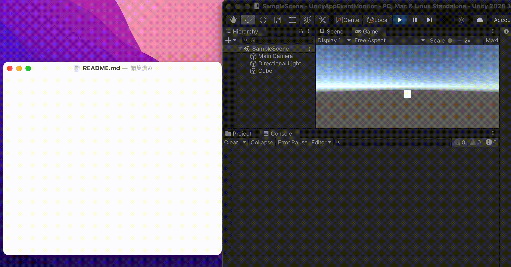
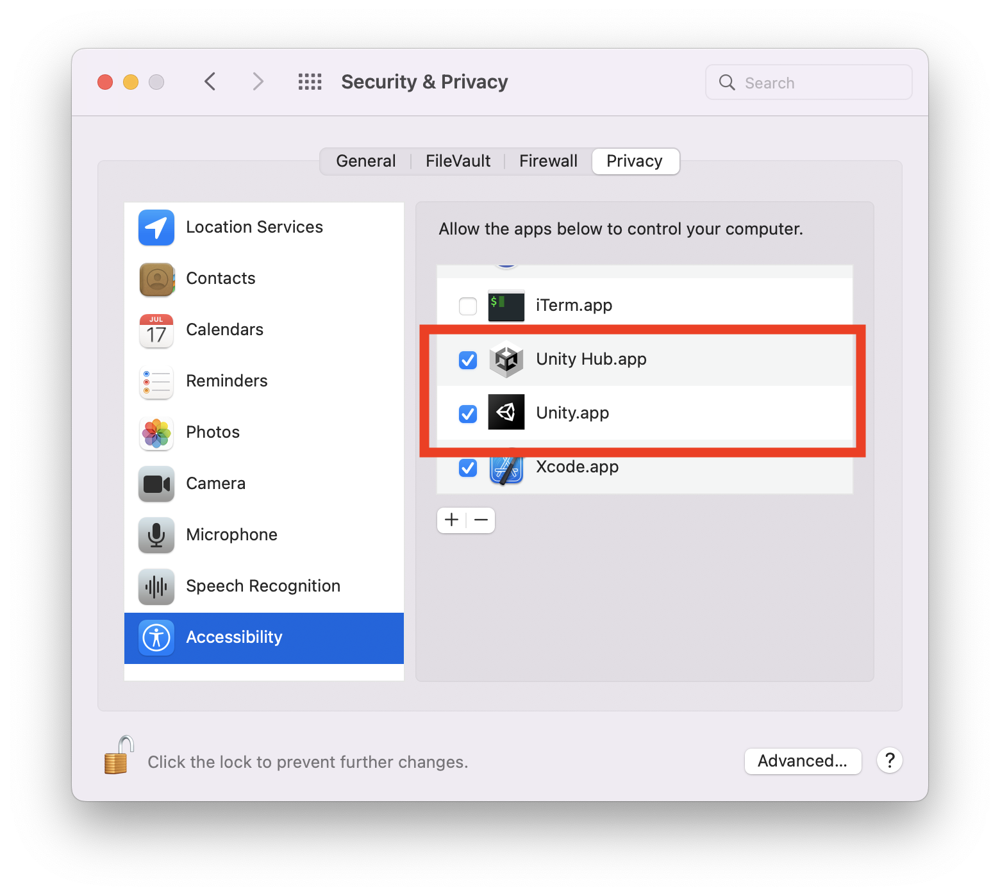

# UnityAppEventMonitor

Unity Native Plugin for [NSEvent.addGlobalMonitorForEvents](https://developer.apple.com/documentation/appkit/nsevent/1535472-addglobalmonitorforevents).  
Receive keyboard input even when your Unity application is in the background with no focus.  
This plugin supports macOS 12 or later.  

  

# Installation
Download AppEventMonitor.unitypakcage from the release page and install it in your project.  
To allow monitoring of keyboard input in the background, you need to add Unity to Accessibility.  
Open `System Preferences` > `Security & Privacy` > `Privacy` > `Accessibility` and add `Unity.app`.  
(And `Unity Hub.app` if you use)  

  

# Usage

Include package.

```cs
using AppEventMonitor;
```

Add action.


```cs
private void OnKeyDown(string key)
{
    Debug.Log($"OnKeyDown: {key}");
}
AppEventMonitorManager.OnKeyDown += OnKeyDown;
```

Start monitoring.

```cs
AppEventMonitorManager.Start();
```

Stop monitoring.

```cs
AppEventMonitorManager.Stop();
```

Example

```cs
using UnityEngine;
using AppEventMonitor;

public class Cube : MonoBehaviour
{
    // Start is called before the first frame update
    void Start()
    {
        AppEventMonitorManager.OnKeyDown += OnKeyDown;

        Debug.Log("Start!!");
        AppEventMonitorManager.Start();
    }

    void OnDestroy()
    {
        Debug.Log("Stop!!");
        AppEventMonitorManager.Stop();
    }

    private void OnKeyDown(string key)
    {
        Debug.Log($"OnKeyDown: {key}");
    }
}
```
